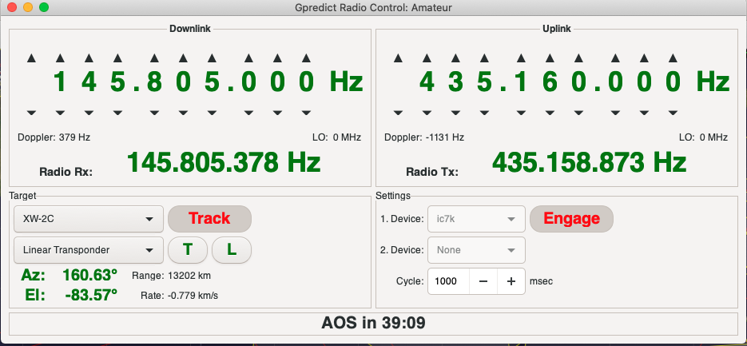
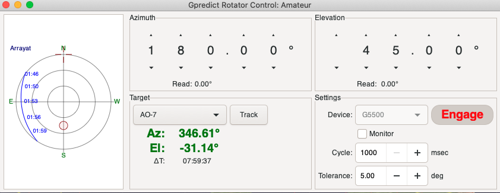
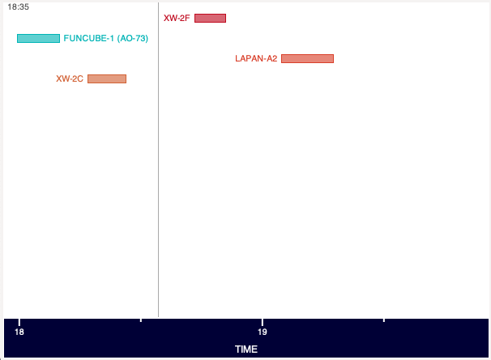
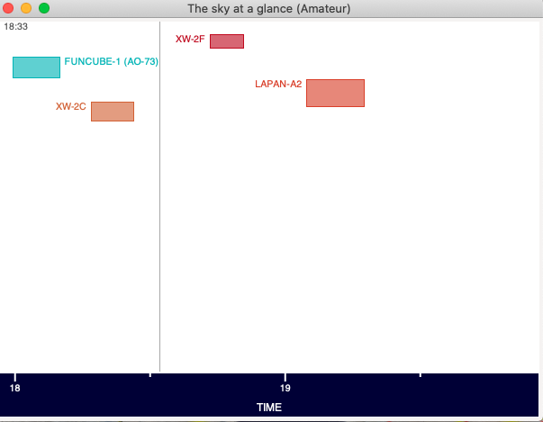

# GPredict

These are my Mods on the excellent GPredict satellite tracking. 


There are 4 features, each one in it's own seperate branch. So it is up to you if you would like all or none of them.

You should be aware that this is not the official, version of gpredict; It is just a few extra things that I wanted.


## toggle_radio

The toggle_radio branch, allows my IC7000 which is not a dedicated SAT rig, to almost behave correctly. I believe that there was some missing configuration in the original code, which I think I have corrected. 

Additionally - depending on the selected SAT some extra rigcontrol commands are sent to the Radio.

At the moment these are limited to MODE Switches, but it is not consistent, and should be improved further.
I believe that the data from SATNOGS would be most appropiate here.


## colorbuttons

I find some of the screens, (Rig Control especially) very dull - so I spiced them up a little, using a custom CSS file.
You are free to change these colors and values to what you want. If you remove them, then the existing color schemes will apply.

The file to move into your $HOME/.config/Gpredict is found in *src/* and is called **src/gpredict.css**

This is what the screens look like now.



And



## beep

The branch called beep, plays an wav file, which you can move/rename (like the css). There are alarms at

  - 5 mins AOS
  - 3 mins AOS
  - 1 min  AOS
  - 30s    AOS
  - 10s    AOS

At the moment there is no way to play a different wav file (it could also be ogg or flac), but that could be easily added.

The wav file need to be moved as ~/.config/Gpredict/audio/arriving.wav

When building this branch, you will almost certainly receive a warning that a library called Allegro is not present... You need to install this

I personnally would pull the source code, and manually build it. It was very straight forward.

## sky_view_height

I like the sky-view option, but I wished that it would convey the max_ele of the satellites in the visualisation.

The standard version looks like 



The modded version looks like this



# How do I apply these mods

You have to build the code yourself. Start with the original branch (2.2.1), and then create a feature you want...

Lets say you want to add **sky_view_height** and **beep**. We first start by getting a copy of my repo.

## Get the repo

	git clone https://github.com/timseed/gpredict.git

## Create a branch for yourself

You now have the code, but let's make sure we can see all the branches first. We will then switch to the "master" branch - and do our work from there....

    cd gpredict
    git branch -a
    git checkout master
    
    
Time for our own branch, called **my2.2**
    
    git checkout -b my2.2
    
You should see a message like 

    Switched to a new branch 'my2.2'
    
## We now will "merge" branches into this

Most developers will place a "feature" on 1 branch. This should make it easy to add just 1 feature. But we are going to add 2 features to the **my2.2**

What are the features available ??? We need to list the branches

    git branch -a
    
Lets add 

    - beep
    - sky_view_height

We type

	git merge origin/beep -m "Add Beeps"
	git merge origin/sky_view_height -m "Add Beeps"
	
## Conflicts

There should not be any conflicts with the two merge's I used (this was a deliberate choice) - however some conflict (this is where the same file, has been modified by each feature) resolution may need to be done. 

You need to edit the conflicting file  - it will have '<<<<<<<' and '>>>>>>>>>' showing you what the differences are.

When you have finished editing this file... you should add it to your my2.2 build, as you have changed the source code.


## Finally you compile the code

This should be as simple as 

```bash
    ./configure --prefix=$HOME/gpredict
```    
   
Or if you want a debug version 

```bash
./configure --prefix=$HOME/gpredict CFLAGS=-g LDFLAGS=-g
```

You should build using 

    make && make install 
    
Note: Becuase I used the prefix in the configure, it will be installed in your filespace (this means you can keep the original gpredict and compare).


 